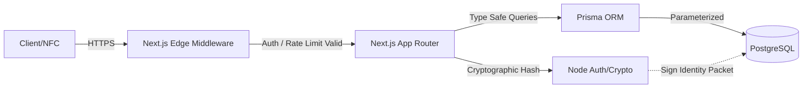
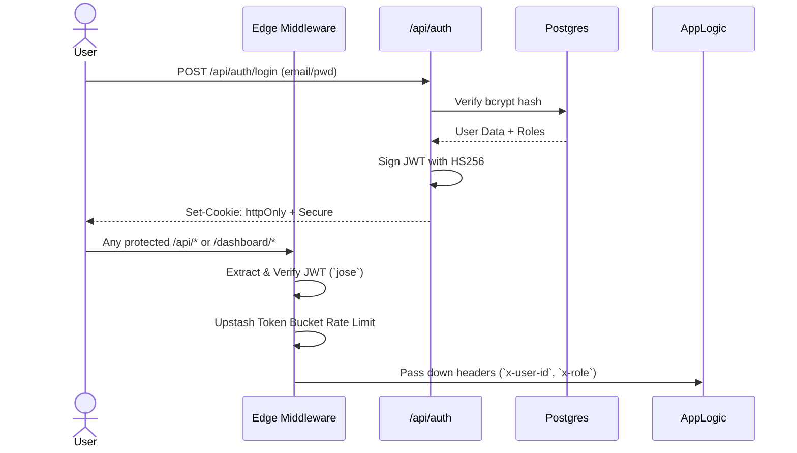
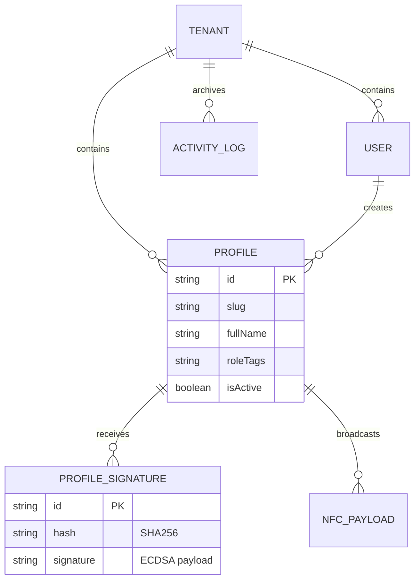

<div align="center">

# 🪪 Identity Capsule OS
**Cryptographically-signed, NFC-enabled digital identity platform built for the modern web.**

[](https://nextjs.org/)
[](https://www.typescriptlang.org/)
[](https://www.prisma.io/)
[](https://www.postgresql.org/)
[](https://tailwindcss.com/)
[](https://opensource.org/licenses/MIT)
[](https://opensource.org/licenses/Apache-2.0)

*Multi-tenant · ECDSA-signed · Role-based · One-tap NFC sharing*

[🚀 Live Demo](#) · [📖 Docs](#) · [🐛 Issues](#) · [🤝 Contribute](#)

</div>
<br/>

## 🗂️ Table of Contents

| Section | Link | Description |
| :---: | :--- | :--- |
| 🟦 | [**Overview & Directives**](#-overview--engineering-directives) | Architecture, Design Principles, & Use Cases |
| 🟩 | [**System Architecture**](#-system-architecture) | Tech Stack & Request Lifecycle Flowgraphs |
| 🟨 | [**Features & Capabilities**](#-feature-matrix) | Capabilities / Access Table |
| 🟫 | [**Data Model**](#-data-model) | Prisma Schema Reference & ERDs |
| 🟥 | [**Auth & RBAC Flow**](#-auth--rbac-flow) | JWT Lifecycle & Security Models |
| 🟪 | [**Cryptographic Signing**](#-cryptographic-signing--zero-trust) | ECDSA P-256 Signatures & Verification Flow |
| 🩵 | [**NFC Payload System**](#-nfc-payload-system) | Three Application NFC Modes |
| 🟢 | [**Usage & Quick Start**](#-way-to-use-the-system--quick-start) | Clone, configure, migrate, and run! |
| 🤖 | [**Automation & CI/CD**](#-automation) | Actions & Deployment setup |
| ⚙️ | [**Configuration**](#️-environment-variables) | Environment Variables |
| 🔒 | [**Security Posture**](#-security-posture) | Threat Models & Edge Limiters |
| 📁 | [**Project Structure**](#-project-structure) | Repository layout |
| 📜 | [**Licenses**](#-open-source-software-licenses) | Apache 2.0 / MIT Dual Licensing |

---

## 🟦 Overview & Engineering Directives

**Identity Capsule OS** solves the problem of easily lost, cryptographically weak physical ID cards by bridging physical sharing (NFC) with uncompromising cryptographic integrity (ECDSA Signatures). 

### The Problem → Solution
| Traditional ID Cards | Identity Capsule OS |
| :--- | :--- |
| Static, printed, easily lost | Dynamic, digital, always updated |
| No cryptographic trust | **ECDSA P-256 signature** on every payload |
| No access control | Multi-tenant RBAC with 4 execution roles |
| Requires manual sharing | **One-tap NFC** + QR code generation |
| No audit trail | Full activity log with **immutable records** |
| Single format | vCard 3.0, JSON Identity Packet, NFC NDEF |

### Senior Engineering Directives
1. **Zero-Trust Signatures**: Every identity packet is signed with ECDSA P-256 locally at the edge/server before distribution.
2. **Strict Multi-Tenancy**: Tenant-id scoped middleware enforces hard logical partitions across all organizations utilizing the SaaS.
3. **Least Privilege**: Edge-verified JSON Web Tokens (JWT) using `jose` evaluate authorization *before* routing hitting application logic.
4. **Resiliency**: Built-in sliding-window memory/Redis edge rate-limiting and structured `pnpm` workspace tooling.
5. **Observability**: Immutably auditable via snapshot-based tracking (before/after modifications captured locally).

---

## 🟩 System Architecture

Our core system processes requests securely over Edge routing to localized Lambdas/Serverless functions prior to touching standard Database engines safely via ORM encapsulation.

### General Component Flow


### Authentication Architecture


---

## 🟨 Feature Matrix

| Route | Method | Auth Req. | Level | Purpose |
| --- | --- | --- | --- | --- |
| `/api/auth/login` | `POST` | ❌ | — | Issue JWT session |
| `/api/profile/[slug]` | `PATCH`| ✅ | Owner/Admin | Update Capsule Profile |
| `/api/profile/[slug]/sign` | `POST`| ✅ | Owner/Admin | ECDSA-signs the identity JSON representation |
| `/api/profile/[slug]/nfc` | `GET` | ✅ | Any | Streams binary NFC NDEF payload |
| `/api/vcard/[slug]` | `GET` | ❌ | Optional | Streams native `.vcf` format file |
| `/api/admin/*` | `...` | ✅ | `ADMIN` only | User Management & Tenant audits |

---

## 🟫 Data Model

We utilize a relational normalized database design strictly sandboxed per tenant (`Tenant`). 



---

## 🟪 Cryptographic Signing & Zero Trust

When a profile is locked or issued to an employee, the system calculates a canonical JSON representation of their data.

1. **Hashing**: Takes the JSON representation and issues a strictly deterministic `SHA-256` digest.
2. **Signing Process**: Using `Node.js` internal Crypto module or subtle-crypto, the Digest is signed via your private `SIGNING_PRIVATE_KEY_BASE64` utilizing the `prime256v1` (P-256) curve.
3. **Verification**: Any external agent can use the Organization's `SIGNING_PUBLIC_KEY_BASE64` to mathematically prove the Identity has not been tampered with.

---

## 🩵 NFC Payload System

The system outputs binary buffers ready to be pushed onto standard NTAG 215 / 216 NFC tags.

| Mode | Standard | Size Profile | Action / Use Case |
| --- | --- | --- | --- |
| **URL** | `URI` | ~50 bytes | Bumps a phone directly to a Hosted Profile Webpage (Ideal size) |
| **VCARD** | `MIME text/vcard` | ~500 bytes | Prompts user immediately to "Save to Contacts" native app |
| **IDENTITY_PACKET** | `MIME app/json` | ~2.5 KB | Transmits the full profile array + **ECDSA Cryptographic Signature** |

---

## 🟢 Way to Use the System / Quick Start

Get your OS up and running on your local machine dynamically in three simple commands. 

### Prerequisites
- Node.js `≥ 20.x`
- Database: `postgres` instance.
- Tooling: `pnpm` (Install via `npm install -g pnpm`)

### 1-2-3 Installation

```bash
# 1. Clone the environment down natively
git clone https://github.com/FTHTrading/Vs-Identity-os.git
cd Vs-Identity-os
pnpm install

# 2. Automagically Configure Core Edge Crypto 
# (This script securely bounds your Node JWT constraints + auto-generates your ECDSA key pairs)
pnpm setup

# NOTE: Fill in `DATABASE_URL` in the `.env` file generated by the setup

# 3. Fire Engine (Migrates DB, loads starter defaults, fires localhost)
pnpm db:migrate && pnpm db:seed && pnpm dev
```

*Your default seed credentials to access the Dashboard:*
*Email:* `admin@example.com`
*Password:* `admin123!`

---

## 🤖 Automation
Identity Capsule OS is heavily engineered with comprehensive Github Workflows and Scripts out of the box.

*   `pnpm setup:netlify` - Bootstraps automated Netlify configurations pushing local `.env` cryptographics into your Prod CLI.
*   **`.github/workflows/ci.yml`** - Guarantees PR integrity (Zero lint deviations, Type safety lock, Build artifact passing)
*   **`.github/workflows/deploy.yml`** - Live Netlify Pipeline for production triggers.

---

## 🔒 Security Posture

Our philosophy utilizes Defense-in-Depth mechanics, mitigating the OWASP Top 10 by design.

*   **Layer 7 (Application Logic)**: Input serialization checked synchronously by `Zod`. SQL Injections made impossible via Prisma Parametrization.
*   **Layer 6 (RBAC)**: All mutations check `TenantID` boundaries. 
*   **Layer 3 (Edge)**: Rate-limiting active via sliding-window limiters built directly into Next.js Edge Middleware logic (`@upstash/ratelimit`). Dropped before processing occurs.
*   **Layer 2 (Encryption)**: JWT signed sequentially via Edge algorithms, passwords salted and hashed natively at factor 12.

---

## ⚙️ Environment Variables 

| Variable | Description |
| :--- | :--- |
| `DATABASE_URL` | Your strict connection URL string to PostgreSQL |
| `JWT_SECRET` | System Auth seed salt (64 hex auto gen available) |
| `JWT_REFRESH_SECRET` | System Refresh Auth salt |
| `SIGNING_PRIVATE_KEY_BASE64` | Auto-encoded Base64 string of the ECDSA `sec1` PEM |
| `SIGNING_PUBLIC_KEY_BASE64` | Auto-encoded Base64 string of the ECDSA `spki` PEM |

---

## 📁 Project Structure 
```markdown
app/
 ├── api/           # Route endpoints for auth, profiling, NFC endpoints
 ├── dashboard/     # Internally protected RBAC SaaS UI Layouts
 └── profile/       # Public-facing routing & rendering pipelines
components/         # React primitive elements
lib/                
 ├── nfc.ts         # Encodes raw URI/MIME arrays
 ├── crypto.ts      # ECDSA subtle signers
 ├── rate-limit.ts  # Node Edge Limiter Map
 └── activity-logger.ts # Auditing & mutation triggers
prisma/             # Source of TRUTH database models (`schema.prisma`)
middleware.ts       # Application guardian logic (Token checks & Limit drops)
```

---

## 📜 Open Source Software Licenses 
This software utilizes a Dual-Licensing methodology to provide both commercial flexibility and open-source guarantees.

**Licensed under [MIT License](LICENSE-MIT) and [Apache License, Version 2.0](LICENSE-APACHE).**

### MIT License Summary
Permission is hereby granted, free of charge, to any person obtaining a copy of this software and associated documentation files to deal in the Software without restriction, including without limitation the rights to use, copy, modify, merge, publish, distribute, sublicense, and/or sell copies...

### Apache 2.0 License Summary
Licensed under the Apache License, Version 2.0 (the "License"); you may not use this file except in compliance with the License. This grants specific definitions regarding patent indemnifications and contributor assurances...

*Check the repository root for the full license documents.*

---
<div align="center">

Built with love and precision by **FTHTrading.**  
*Because digital business deserves digital security guarantees.* ❤️

</div>
